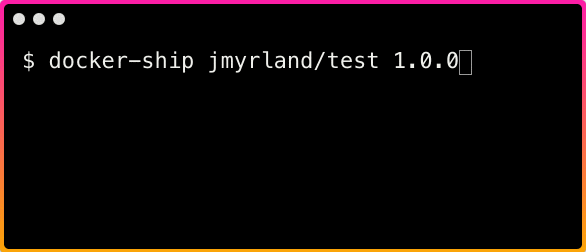

# `docker-ship`

Build, tag and push docker images in one command.

Installation:

    npm i -g docker-ship

Usage:

  	docker-ship [imageName] [nextVersion]

    Positionals:
      nextVersion  version to deploy (prompted if missing)                  [string]
      imageName    docker image name (prompted if missing)                  [string]

    Options:
      --version  Show version number                                       [boolean]
      --help     Show help                                                 [boolean]

Executing `docker-ship` with the same parameters, with only the `nextVersion` changing can be tedious. You can add default values to a `package.json` file to avoid this.

When executing `docker-ship` in a folder with the following `package.json` file, both `version` and `dockerRepository` will be read as parameters.

    {
      "version": "1.0.0",
      "dockerRepository": "jmyrland/test"
    }

- `version` is treated as the current version of the docker image, and will be used to ensure that the next version is newer. It will also be used to suggest a new version (when prompted).
- `dockerRepository` is treated as the `imageName`.

-----------------

Tested with
- macOS version 10.13.4
- Node version 9.5.0
- Docker version 18.04.0-ce-rc2, build f4926a2

